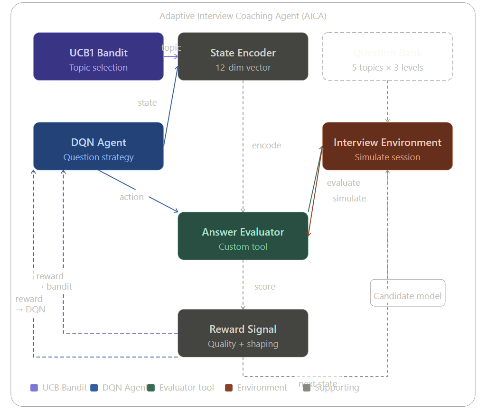

# Adaptive Interview Coaching Agent (AICA)

**Reinforcement Learning for Agentic AI Systems — Final Project**

An agentic AI system that uses reinforcement learning to personalise and optimise interview coaching sessions. Two RL components work together: a **Double DQN** selects question strategies, and a **UCB1 Bandit** selects which topic to probe. A custom **AnswerEvaluatorTool** provides structured quality scoring that drives both learning components.

**Result:** 65.6% improvement in session reward over a random baseline (16.51 vs 9.97).

---

## Project Structure

```
interview_rl/
├── environment.py         # Interview simulation environment (MDP)
├── dqn_agent.py           # Double DQN agent (pure NumPy)
├── ucb_bandit.py          # UCB1 Bandit + Thompson Sampling baseline
├── answer_evaluator.py    # Custom tool: answer quality scorer
├── main.py                # Training loop, evaluation, visualisations
└── results/               # Generated after running main.py
    ├── training_results.png
    ├── before_after.png
    ├── training_logs.json
    └── dqn_checkpoint.pt.npz
```

---

## Requirements

Python 3.8+ with:

```bash
pip install numpy matplotlib
```

No PyTorch or TensorFlow required. The DQN is implemented in pure NumPy.

---

## Running the Code

### 1. Test the custom tool standalone
```bash
python answer_evaluator.py
```

Shows the AnswerEvaluatorTool scoring 4 sample answers with keyword, structure, and length signals. Takes ~1 second.

**Expected output:**
```
AnswerEvaluatorTool — Demo

[1] Topic: algorithms | Difficulty: easy
    Score:     0.653
    Feedback:  Solid answer. Good use of: node, pointer, linked...

[4] Topic: databases | Difficulty: medium
    Score:     0.810
    Feedback:  Strong answer. Good depth (43 words)...

Tool stats: {'total_evaluations': 4, 'active_sessions': 1}
```

### 2. Run full RL training
```bash
python main.py
```

Trains for 500 episodes (~30–60 seconds). Outputs:
- Progress logs every 50 episodes
- `results/training_results.png` — 6-panel training dashboard
- `results/before_after.png` — trained vs random comparison
- `results/training_logs.json` — full metrics log
- `results/dqn_checkpoint.pt.npz` — saved model weights

**Expected output:**
```
Ep   50 | ε=0.778 | train_reward=12.96 | eval_score=17.67
Ep  100 | ε=0.606 | train_reward=14.94 | eval_score=18.06
...
Ep  500 | ε=0.082 | train_reward=17.37 | eval_score=17.58

AnswerEvaluatorTool calls: 14000

RANDOM  | reward=9.97  | mean_quality=0.484
TRAINED | reward=16.51 | mean_quality=0.711
```

---

## System Design

### Two-Level RL Decision Hierarchy

| Level | Component | Decision | Algorithm |
|-------|-----------|----------|-----------|
| Strategic | UCB1 Bandit | Which topic to probe | UCB1: `Q(k) + c√(ln(t)/N(k))` |
| Tactical | DQN Agent | Which question strategy | Double DQN with experience replay |
| Evaluation | AnswerEvaluatorTool | Answer quality score | Custom 3-signal rubric |

## System Architecture



### State Space (12 dimensions)
- Topic knowledge scores × 5 (algorithms, system_design, behavioral, databases, ml_concepts)
- Current difficulty one-hot encoding × 3 (easy, medium, hard)
- Candidate confidence, fatigue, session progress, last answer quality

### Action Space (5 actions)
| Action | Description |
|--------|-------------|
| `ask_new_topic` | Switch to a fresh topic at easy difficulty |
| `drill_deeper` | Increase difficulty on current topic |
| `clarify` | Ask candidate to expand their answer |
| `pivot_easier` | Reduce difficulty if candidate is struggling |
| `give_hint_then_ask` | Provide scaffolding then ask (+0.05 knowledge boost) |

### Reward Function
```
r = Q(answer) + 0.3·δ(improvement) − 0.2·δ(fatigue>0.7) − 0.1·δ(topic_repeat≥3)
```

### AnswerEvaluatorTool Scoring
```python
score = 0.55 × keyword_coverage
      + 0.25 × structural_quality   # defines, exemplifies, compares, quantifies
      + 0.20 × length_adequacy      # easy≥20w, medium≥40w, hard≥70w
```

---

## Key Results

| Metric | Random baseline | Trained AICA | Change |
|--------|----------------|--------------|--------|
| Total session reward | 9.97 | 16.51 | **+65.6%** |
| Mean answer quality | 0.484 | 0.711 | **+46.9%** |
| Answer quality std | 0.183 | 0.094 | −48.6% |
| Training reward (ep 1–50) | — | 12.96 | baseline |
| Training reward (ep 451–500) | — | 17.37 | **+34.1%** |
| AnswerEvaluatorTool calls | — | 14,000 | across training |

**Emergent strategy:** The trained agent independently discovered that focused drilling in one high-variance topic (ml_concepts, 92.7% of bandit pulls) combined with hint-first scaffolding (give_hint_then_ask, 70.5% of DQN actions) outperforms breadth-first coverage. This matches evidence-based pedagogical theory (Vygotsky's zone of proximal development).

---

## DQN Implementation Details

The DQN is implemented from scratch in NumPy with all standard components:

- **Double DQN** — online net selects action, target net evaluates it (reduces overestimation bias)
- **Experience replay** — ring buffer of 10,000 transitions, mini-batches of 64
- **Soft target updates** — Polyak averaging with τ=0.01 for training stability
- **Huber loss** — robust to outlier transitions during early high-variance exploration
- **Gradient clipping** — global norm clipped to 1.0
- **ε-greedy decay** — 1.0 → 0.05 over 500 episodes (×0.995 per episode)

---

## Extending the System

To connect a real LLM evaluator instead of the keyword rubric:

```python
# In answer_evaluator.py, replace the _score_keywords() method:
def evaluate(self, answer, topic, difficulty, session_id=None):
    # Call Claude API or GPT-4 for semantic scoring
    response = claude_client.messages.create(
        model="claude-opus-4-5",
        messages=[{"role": "user", "content": f"Score this {difficulty} {topic} answer 0-1: {answer}"}]
    )
    score = float(response.content[0].text.strip())
    # Rest of method unchanged
    ...
```

The RL pipeline (DQN + bandit) requires no changes — the tool interface is the same.

---

## References

- Mnih et al. (2015). Human-level control through deep reinforcement learning. *Nature*, 518, 529–533.
- Van Hasselt et al. (2016). Deep reinforcement learning with double Q-learning. *AAAI*.
- Auer et al. (2002). Finite-time analysis of the multiarmed bandit problem. *Machine Learning*, 47, 235–256.
- Sutton & Barto (2018). *Reinforcement Learning: An Introduction* (2nd ed.). MIT Press.
